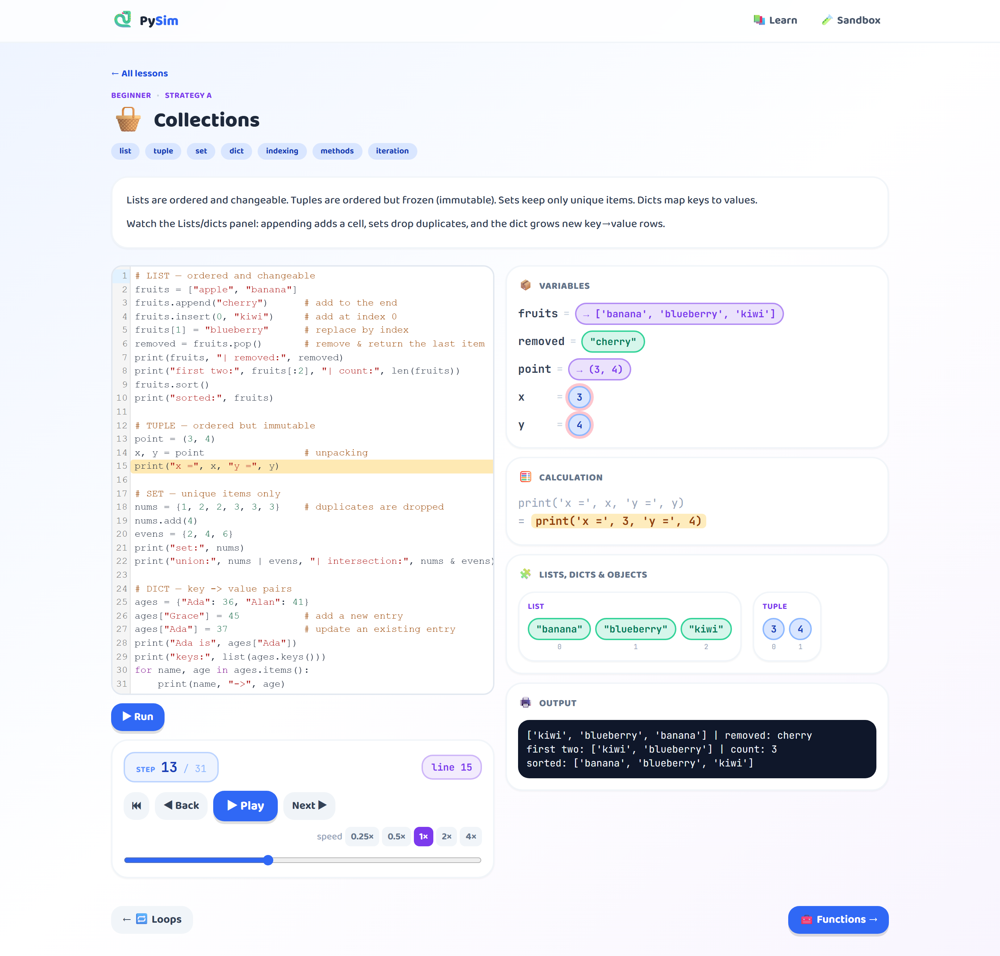
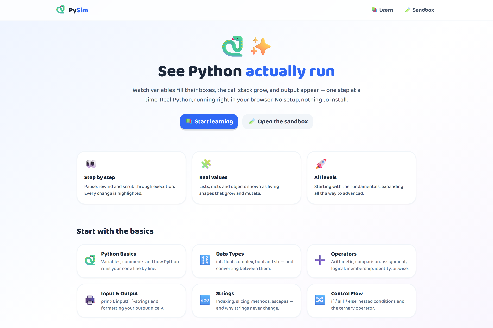

# PySim — See Python Run

An interactive web app that makes Python concepts **visually obvious**. It runs
real CPython in your browser (via [Pyodide](https://pyodide.org)) and animates
execution **step by step** — variables filling their boxes, the call stack
growing and shrinking, lists/dicts mutating, output appearing line by line.



> Step through any concept: watch the highlighted line execute, see the
> **calculation worked out** (`print('x =', 3, 'y =', 4)`), variables update,
> and the heap of lists/dicts/sets come alive.

<p align="center"></p>

Two modes, one engine:

- **Learn** — curated, animated lessons per concept (Beginner tier ships now).
- **Sandbox** — type any Python and watch it execute; share via URL.

## Run it

```bash
npm install
npm run dev      # open the printed localhost URL
npm run build    # production build into dist/
```

> First run downloads Pyodide (~a few MB) from the CDN, cached afterward.

## How it works

```
React UI (main thread)  ──run──▶  Web Worker ──▶ Pyodide (CPython/WASM)
        ▲                                              │
        └──────── ExecutionStep[] (JSON trace) ◀── tracer.py (sys.settrace)
```

`src/pyodide/tracer.py` traces the program with `sys.settrace`, snapshotting the
call stack, locals, a heap of referenced containers/objects, and stdout at every
step. The UI then animates through that trace locally (instant scrub, no
round-trips).

## Project layout

- `src/pyodide/` — worker, client, and the Python tracer.
- `src/engine/` — `types.ts` (trace shape) and `usePlayer.ts` (playback).
- `src/components/` — editor, controls, and `viz/` visualization views.
- `src/lessons/` — lesson `registry.ts`, types, beginner content, custom scenes.
- `src/sandbox/`, `src/pages/` — the sandbox and routed pages.

## Roadmap

The full curriculum (Beginner → Expert + domain specializations) is planned in
phases. Each new concept is a registry entry using one of three strategies:
**A** trace-driven (most topics), **B** custom animation (sorting, data
structures, async, memory), **C** diagram/walkthrough (architecture, patterns).
See the plan for the complete catalog.
